# Mac 本地跑 Qwen3.6-27B：4bit 居然能到 40+ tok/s？我实测了 4 种方案

大家好，我是 Kate。这期视频准备了非常久，主要想和大家聊一聊我对 Qwen3.6-27B 的实测情况，以及我在 Mac 上通过几种不同的方式来运行它所得到的不同结果。

## 一、关于 Qwen3.6-27B

Qwen3.5-27B 推出后就非常受欢迎，Hugging Face 上也涌现了很多基于它的微调版本，普遍认为它的性能相当强。升级到上个月发布的 Qwen3.6-27B 之后，它被定位为旗舰级、可在本地运行的智能体编程模型，关键看点在于用一个 27B 的稠密模型去挑战前代 397B MoE 的旗舰模型（Qwen3.5-397B-A17B）。

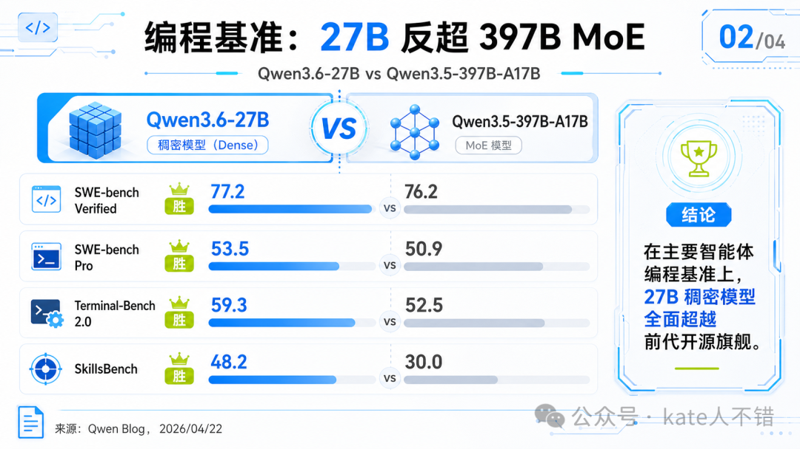

  

这次官方特别强调了它的编码能力。无论是在 SWE-bench Verified、SWE-bench Pro，还是 Terminal-Bench 2.0 等基准上，它的表现都要强于规模更大的前代模型；在文档理解、VQA、视频理解、视觉智能体等方面，它的表现也相当出色。

目前最简单的体验方式，就是直接到 Qwen Studio 官网上去试用——官网部署的版本，是我们能体验到的最好的版本。

## 二、本地运行的选择与速度变化

我在上个月就尝试在本地跑这个模型。一开始用的是 Unsloth 出品的动态量化 Q5、GGUF 格式版本，当时生成速度大约是 18 tok/s，模型一跑起来风扇就呼啦呼啦地响。

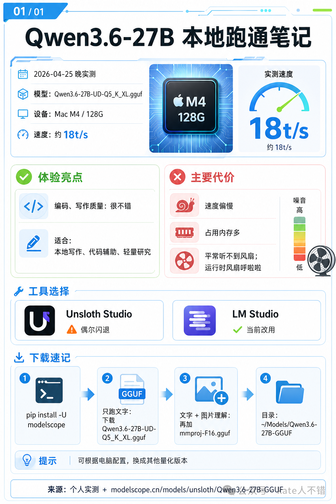

Mac 端和 Windows 端的体验差异很大。在 Windows 上，很多用户用 3090 或 4090 就可以很顺畅地跑 Qwen3.6-27B，速度也挺快。但在 Mac 上跑这样的稠密模型，一方面速度普遍偏慢，另一方面可选的后端实在太多了。

之前我介绍过 LM Studio、Ollama、Unsloth Studio，这些已经算是"旧"方案了。现在比较新的有 oMLX、DFlash-mlx，以及我今天要重点介绍的 MTPLX。习惯用 oMLX 的朋友可以持续关注它，开发版本最近做了不少优化；Unsloth 最近也推出了实验性的 MTP 版 Qwen3.6 GGUF 模型。

后来我尝试了 Unsloth 推出的 6bit MLX，再叠加 DFlash，生成速度提升到了 22 tok/s。而切换到 MTPLX 之后，4bit 模型的生成速度直接翻倍，提升非常明显。即便是 4bit，输出质量也依然不错。

我这里用的是它默认对应的 Speed 模型，也就是 4bit 版；如果想要更高质量的输出，可以下载作者最新发布的 27B 高质量版本。

https://huggingface.co/Youssofal/models

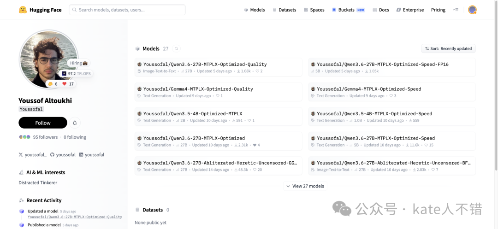

## 三、社区里的几位实践者

知名开发者 Ivan Fioravanti 围绕 27B 做了非常多的分享。他用 DFlash-mlx 搭配 Z Lab 出品的 draft 模型，初步测试下来认为 DFlash 明显比单独使用 MTP 更快，但在质量上观察到了一些退化。

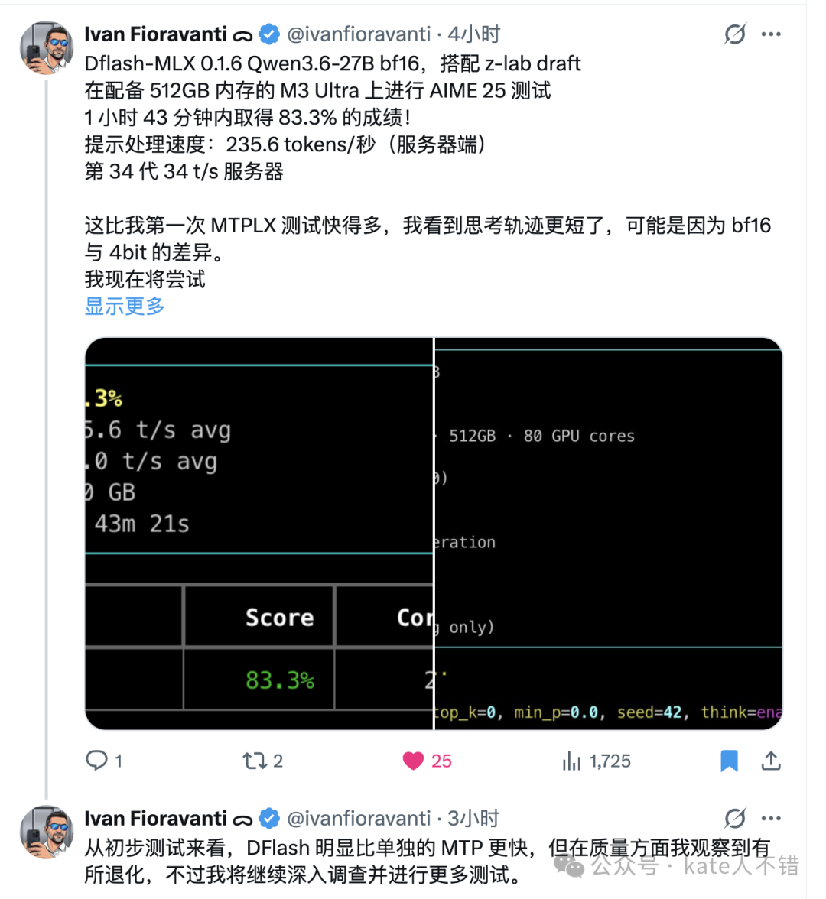

他还分享了对 MTPLX 最新 0.3.5 版本的测试体验：在一个数学基准测试上，5 小时 30 分钟内取得了 93.3% 的正确率，在他看来 MTPLX 的输出质量是相当不错的。

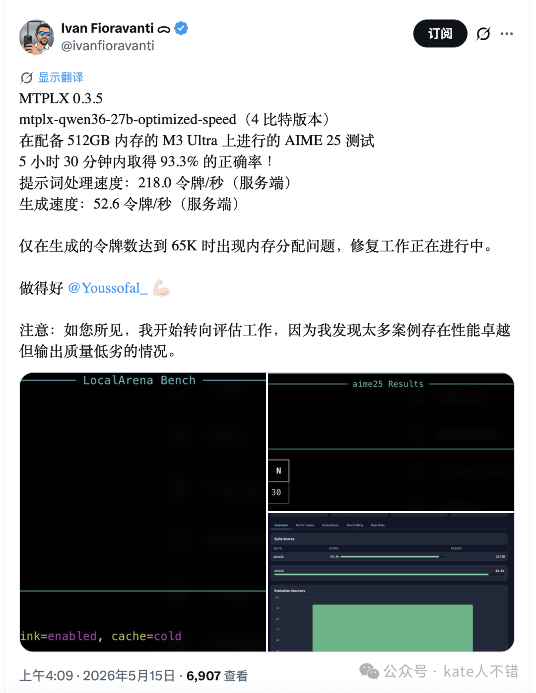

另外一个机构 AtomicChat 则在 llama.cpp 上为 Qwen 实现了 MTP。

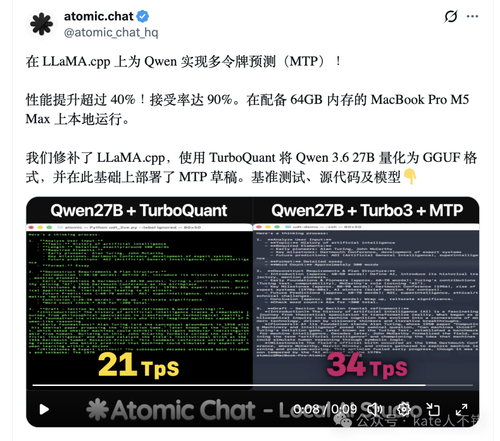
'%20fill='%23FFFFFF'%3E%3Crect%20x='249'%20y='126'%20width='1'%20height='1'%3E%3C/rect%3E%3C/g%3E%3C/g%3E%3C/svg%3E)

  

之所以说这期视频做了很久，就是因为我在不断接收这些不同的方法，再逐一去尝试，所以中间花了挺长的时间。

我还看到一位博主用 MTPLX 加 4bit 模型，做出了一个内容非常丰富的城市场景游戏：里面有大量建筑、小车、广场、树木、道路，还有很大的广告牌，大概率不是一次迭代生成的。镜头里能看到健身房、电影院、教室等多种场景，都做得相当不错。

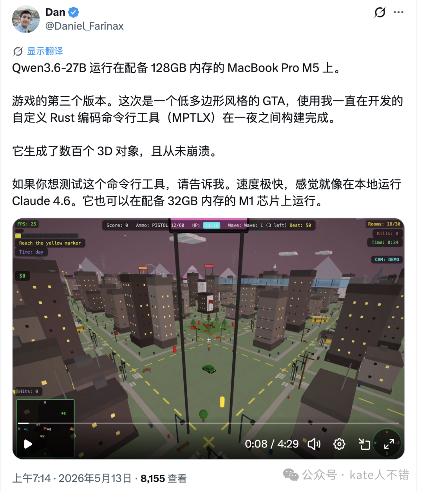
## 四、四个渠道的实测对比

接下来分享我通过四个不同渠道使用 Qwen3.6-27B 的效果。

### Qwen 官网版本

先看 Qwen Studio 官网部署的版本。"纤夫拉船"这道题，它生成的船不知为何从山体里冒出来，逻辑上有点问题；鼠标所指的位置渲染也有些瑕疵；缩小画面来看，其他场景里的植物有一部分是飘在空中的。所以在这个任务上它的表现一般。

随后我把这张图发给 27B 让它复刻页面，复刻效果就相当不错了。背景部分，因为当时是下午六点多，它已经自动切换成了夜间模式；唯一不太像的是云朵样式，和我一开始发给它的不太一致。

"十字路口交通仿真"这一题，会看到有建筑直接被放在了道路上，出现了穿模现象；车辆方向也稍微有点问题。但道路本身画得挺有细节，左侧的控制面板和右侧的实时统计数据维度都很丰富，说明它的思考还是相当充分的。

"3D 魔尺模拟器"中，当我选择球形预设造型时，它生成的并不是球形；点击不同关节进行切换时，也出现了 bug。

"礼物包装智能助手"中，选中长方体并点击智能分析包装方案后，左侧预览仍是立方体，与上方明确选择的长方体不一致。不过造型本身做得还算不错，能看到一个蝴蝶结；只是同一份礼物一般不会出现这么多种不同的画面表现。右侧推荐搭配的丝带切换是 OK 的，但下方的包装纸图案变成了空白。比较有意思的是，它给出了一个具体的包装盒尺寸，也就是说不仅做了包装纸，还做了包装盒本身——这一点我觉得是它做得比较好的地方。

### Qwen3.6-27B-UD-Q5_K_XL.gguf 版本

接下来是用 Unsloth 出品的 UD-Q5 GGUF 27B 模型跑出来的结果。

"仓库分拣仿真系统"整体 UI 还可以，但机械臂的细节问题较大，球甚至直接穿模穿了过去，也就看不到机械臂是如何把物体提取出来的。"十字路口"的仿真效果就要差很多。

"礼物包装智能助手"做的 3D 预览还可以，但切换到圆柱体之后就没有了；点击"智能推荐包装方案"，下方的展开图也丢失了。它的优点是给出了一份很完整的包装步骤指南，右侧丝带方案能实时反映到左边，但下方的包装纸点击没有反应。整个页面非常美观，只是功能上有不少缺失。

"马卡龙花园"我要求它生成花朵的样式，最终的效果不是特别像花朵，但我已经满意了——因为有一些比它更大的闭源模型，连这样的场景都做不出来。唯一的问题是这个场景在我电脑上处理花了非常长的时间。

"魔尺"任务上，它的质量要比官网版本差一些；选预设造型时同样无法展示球形。

"鹈鹕骑自行车"这个体素场景里出现了一些闪烁，自行车没有动起来；不过车下方做了道路设计，能看出 27B 在这里是有过思考的，而且思考得不错。

"纤夫拉船"在我看来效果其实已经很不错了——能看到绳子和纤夫连在一起；只是船往前走的时候，绳子又停在了原地。

### unsloth/Qwen3.6-27B-UD-MLX-6bit + DFlash

第三种方式是用 Unsloth 出品的 6bit MLX 27B 模型，搭配 DFlash 在本地运行。

我让它做了一个理发应用，最终页面里出现了一些乱码，整体设计还行，但错误比较多，做得算是中规中矩。当时主要的体验问题是速度比较慢，所以我没有继续在它身上做更多测试。

不过可以分享一下我是怎么把它配置到电脑上的。当时我对 DFlash 不太了解，就先去问 Grok：DFlash 能不能在 Mac 上运行？得到的回复是可以，并且当时官方的 draft 模型也已经上线，下方还给出了使用方法。后来我看到它推荐了 DFlash-mlx，就让它帮我查询，并把我的电脑内存信息发过去，确认是否能运行——结论是可以。

之后我把一篇相关帖子链接发给 Grok，问 Qwen3.5-27B MLX 会不会被影响，因为它是稠密模型（这里我其实写错了，应该是 Qwen3.6-27B）。接着又问 Qwen3.6-27B 标准 MLX 量化版本是否已经没有这个问题，它告诉我 MLX-Community 出的版本依然存在这个问题——这是 4 月份的回复，目前 MLX 社区里关于这一块的版本更新还是挺多的，所以大家最好以最新版本信息为准。

我又问它，Unsloth UD-MLX 动态混合精度版能否搭配 DFlash 在我的 Mac 上使用，回复是可以。那时我才知道，Unsloth 本身也出 MLX 格式的版本。随后我把一张选项截图发过去问它该选哪一个，它推荐我用 UD-MLX 6bit。

接着我又问：DFlash-mlx 是否一定要装？DFlash 的通俗工作原理是什么？Grok 告诉我，DFlash-mlx 是专门为苹果芯片开发的原生 MLX 端口，官方 Z Lab 的 DFlash 虽然也支持 MLX，但社区版的 DFlash-mlx 会更成熟。它还介绍了 DFlash 的工作原理。当时 DFlash 有一个问题：无法单独选择模型的温度。而按照 Qwen3.6-27B 的官方指导，写作和编码所用的温度最好是不同的。它还提到 Z Lab 出了一个小的 drafter 模型。

我接着问：DFlash 的接受率不是 100%，会影响生成效率吗？会影响生成结果吗？Unsloth 推出的 MLX 版本和 MLX-Community 推出的版本有什么区别？这些问题 Grok 也都一一回复了。

这里之所以选 Grok，主要有两个原因：一是它的搜索覆盖面非常广，生成速度也很快，比较适合查实时性的内容；二是 Twitter 上关于本地部署的用户分享非常多，信息往往是第一手的。

我又问它 DFlash 是否会占用更多资源，回复说会占用少量资源。在这些信息都了解清楚之后，我让 Grok 帮我做一个从 0 到 1 的流程，告诉我如何在本地使用 Unsloth MLX 6bit，并接入到其他 App。

它给出的回复里提到了 OpenAI 的 Base URL，内容非常详细。我又让它改用 uv 来做环境管理。

到这一步，基本上整段回复就可以直接发给 AI Agent——无论是 Codex 还是 Claude Code，让它依据这些信息在本地快速安装。安装好运行起来之后，我想把它接入 Open WebUI，过程中遇到了一些响应问题，也很快交给 AI Agent 解决了。

我还问 Grok：Mac 上使用 DFlash 有什么坏处？DFlash 最早是什么时候推出来的？有没有不稳定的情况？它都给了回答。

因为这些仓库每天都在变化，想了解最新情况最好让 AI 实时帮你答疑。当时 DFlash-mlx 有多个版本，Grok 也帮我查到了，我又追问该选哪一个，以及是否需要用到 oMLX、有什么利弊，它告诉我不需要。

oMLX 现在也在不断改进，大家同样要以最新信息为准。

### mtplx-qwen36-27b-optimized-speed

最后介绍我在 Mac 上使用 MTPLX 的体验。在我这里，它的结果是最快的，质量也相对不错。

MTPLX 的安装挺简单：先用 `brew install` 装好，再通过 `mtplx start` 启动，它有一个交互式命令，会提示你选用什么模型。如果是第一次使用，直接选默认的 Speed 模型即可，选中之后就会进行安装。接着它会让你选择运行模式，同样推荐按默认选；之后它会提示可以通过 Web、CLI、API 或 OpenCode 等渠道进行对话。

我选择了它的 WebUI 打开测试，随便提了一个问题，输出速度是 43.6 tok/s。

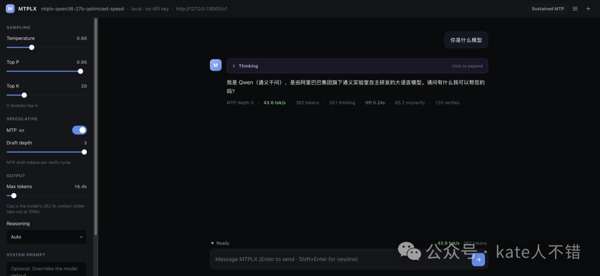

左侧可以调整模型参数——如果是编码任务用 0.6，做一般任务时 Qwen 官方建议把温度调到 1。

本地跑通之后，我直接打开 Open WebUI，不需要额外设置，它就会自动识别出 MTPLX 的 Qwen3.6-27B optimized Speed 模型，也就是前面提到的 MTPLX 默认模型，目前在仓库下载量也非常多。它还有一个更高质量的版本，大家可以自己试一下。

下面是 MTPLX 4bit 版本的输出效果：

"兵马俑街舞"分成了好几个不同的章节，在一个小模型上能呈现出这样的效果，已经相当不错。

"礼物包装智能助手"——左侧点击不同的礼物，右侧会出现对应的预览，整体界面做得相当不错。下方的"场合"参数切换时，右侧会出现不同的包装纸；只是 3D 预览的时候，包装盒和包装纸有点分离。

"绵羊理发店"我觉得生成质量真的挺不错的：小羊头上有蝴蝶夹，理发师正在给绵羊理发，理发师的格子围脖比较美观，椅子的质感不错，还有一张深红色的沙发，整个画面里多个物体的位置摆放和细节都相当不错。稍微遗憾的是窗户和门重合在了一起。

"体素艺术风格的鹈鹕骑自行车"中，自行车动了起来，只是动的方式不太对，没有向前骑，更像是一个摩天轮。下方道路还是能清晰看到的，画面里的内容也比较多，可以看出这个版本的 27B 表现是相当不错的。

"纤夫拉船"里，绳子被画得像一块布，船的细节也不是特别好。另外，MTPLX 目前还有一个问题——不支持图像识别。

"仓库分拣系统"里，物体是凭空出现在机械臂上的，逻辑上有较大问题；箱子的位置也直接堆在了传送带上。但总体而言，已经比我想象中好太多了——请记住，这只是一个 4bit 模型，在我本地是能跑到 40 tok/s 的，质量却相当 OK。

除了编码任务，我也把一些其他类型的任务交给它处理。

写作任务：让它写一个不超过 300 字的微型悬疑故事，效果还不错。

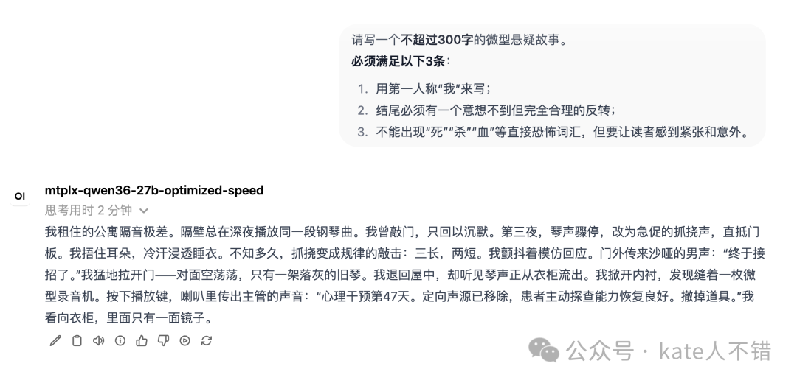

推理题：假设月收入 7000、生活在一线城市、没有存款，想在 4 年内存够 60 万，请给出一个计划。它思考了 1 分钟，最终给出了一份内容非常详尽的回复。我让 GPT-5.5 thinking 给它打分，结果是 50 多分；同样的题目让 GPT-5.5 Pro 做了一遍，再由 GPT-5.5 thinking 来打分，得到了 82 分。可以看到，27B 在推理上和 GPT 的顶尖模型还是有差距的，但在我看来已经很不错。

事实判断：让它介绍唐代诗人李白在 1998 年纽约马拉松比赛中获得亚军的具体经历。它思考之后告诉我，这里存在一个不可调和的历史时间矛盾。

一些小题：把"他很难过"写成一句有画面感的话，不超过 30 字，它的回答是"他蜷在墙角，把脸埋进臂弯，肩膀无声地起伏"——质量很不错。咖啡店新品广告语写的是"新豆初焙，苦甜有分寸"，感觉比较一般。

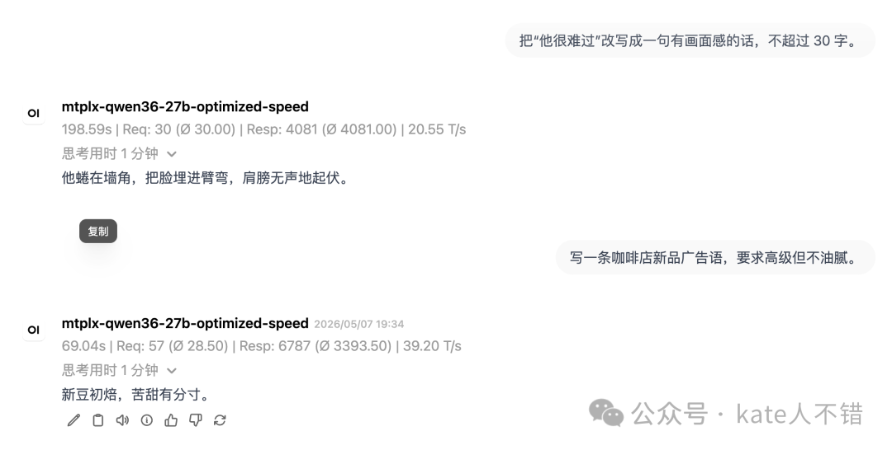

让它写一段 100 字以内的小故事，结尾必须反转，但不能像段子，27B 写道："他每晚都坐在椅子右端，静候路口。直到今天，他终于起身，指尖触到刚铺好的白砖——原来他等的不是归人，是这条竣工的盲道。" 挺有意思，但可能没那么有意思。

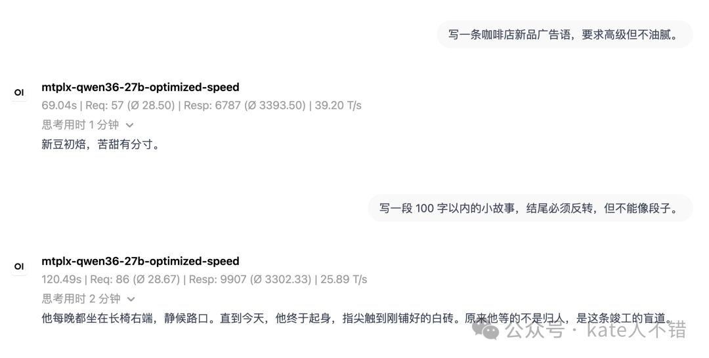

再让它写一段表达"终于辞职了"的文案，要求洒脱、不抱怨，它写的是："交还钥匙，清空日程，不回头谢幕，只向前迎风。原来转身，也可以这么轻。" 还挺好的，至少不是 AI 味很浓的话。

## 五、总结

以上就是今天关于 Qwen3.6-27B 的全部内容。

我在四个渠道体验过这个模型：先是 Qwen Studio 官网，然后是 Unsloth 推出的 UD-Q5 GGUF，之后是 Unsloth 的 MLX 6bit 搭配 DFlash，最后是 MTPLX。目前在我看来比较满意的是 MTPLX——在我的电脑上，它相对其他方式的速度快了将近一倍。遗憾的是这个模型目前没有视觉能力。

这期视频对 27B 的编码能力做了多个角度的体验，可以说 27B 真的挺强的；写作方面也简单体验了一下，效果同样不错。非常推荐大家在本地试用它。

---

## 参考资料

### 模型仓库

- Qwen3.6-27B（官方） https://huggingface.co/Qwen/Qwen3.6-27B
    

- Qwen3.6 GitHub 主仓 https://github.com/QwenLM/Qwen3.6
    
- Qwen3.6-27B 发布博客 https://qwen.ai/blog?id=qwen3.6-27b
    
- unsloth/Qwen3.6-27B-GGUF（含 UD-Q5 动态量化） https://huggingface.co/unsloth/Qwen3.6-27B-GGUF
    
- unsloth/Qwen3.6-27B-UD-MLX-6bit https://huggingface.co/unsloth/Qwen3.6-27B-UD-MLX-6bit
    

- MTPLX 默认 Speed 模型（4bit） https://huggingface.co/Youssofal/Qwen3.6-27B-MTPLX-Optimized-Speed
    
- Z Lab DFlash drafter（Qwen3.6-27B） https://huggingface.co/z-lab/Qwen3.6-27B-DFlash
    

### 运行时与工具

- Qwen Studio（在线体验） https://chat.qwen.ai/
    
- MTPLX https://github.com/youssofal/MTPLX
    
- DFlash（Z Lab 官方项目） https://z-lab.ai/projects/dflash/
    
- DFlash-mlx（Apple Silicon 社区移植） https://github.com/Aryagm/dflash-mlx
    
- oMLX https://github.com/jundot/omlx
    

- AtomicChat HF 主页（GGUF 量化集合） https://huggingface.co/AtomicChat
    

- Unsloth（Studio / 文档主页） https://unsloth.ai/
    
- Unsloth Qwen3.6 部署文档 https://unsloth.ai/docs/models/qwen3.6
    
- Open WebUI https://github.com/open-webui/open-webui
    

### 知名开发者

- Ivan Fioravanti（X / Twitter） https://x.com/ivanfioravanti
    
